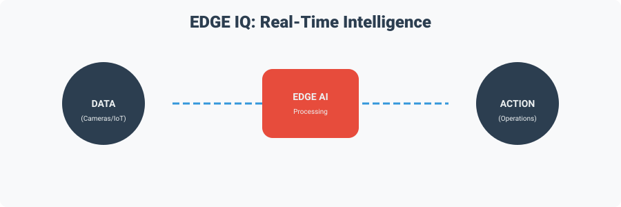

<!-- Animated Header Banner -->
<div align="center">
  
  
  <br>

  <a href="https://git.io/typing-svg"></a>

  <br>
  
  

  <br>

  [](#)
  [](#)
  [](#)

</div>

<p align="center">
  <strong>From passive retail monitoring to closed-loop retail intelligence.</strong>
</p>

---

## ⚡ Overview: What is EDGE IQ?

**EDGE IQ** is a proposed edge-first intelligent retail management architecture designed to connect physical-store data sources with local intelligence and operational decision-making. 

Physical retail generates data everywhere. **EDGE IQ turns that data into decisions where it happens.**

<div align="center">
  <h3>✨ The Core Loop ✨</h3>
  
</div>

---

## 🚀 Key Features & Capabilities

<table align="center">
  <tr>
    <td align="center" width="33%">
      
      <br><strong>Edge AI Processing</strong>
      <br>People & Product Detection, Shelf Monitoring, Zone Analytics
    </td>
    <td align="center" width="33%">
      
      <br><strong>Smart Inventory</strong>
      <br>Real-Time Stock Monitoring, Low-Stock Detection, FEFO Management
    </td>
    <td align="center" width="33%">
      
      <br><strong>Frictionless Shopping</strong>
      <br>QR Shopping, Smart Trolleys, Seamless Checkout
    </td>
  </tr>
  <tr>
    <td align="center">
      
      <br><strong>Queue Intelligence</strong>
      <br>Congestion Prediction, Checkout Occupancy
    </td>
    <td align="center">
      
      <br><strong>Privacy-Aware</strong>
      <br>Movement Analysis over Identity Tracking
    </td>
    <td align="center">
      
      <br><strong>Offline-First</strong>
      <br>Continuous Operations during Connectivity Disruptions
    </td>
  </tr>
</table>

---

## 🏗️ Architecture

EDGE IQ unifies fragmented store systems (CCTV, Barcodes, RFID, POS, Sensors) into a cohesive intelligence layer.

<div align="center">
  
</div>

### 🧩 System Layers

<details>
<summary>👥 <b>Customer Interaction Layer</b> <i>(Click to expand)</i></summary>
Provides customer-facing interaction through QR Shopping, Smart Trolleys, and Web Interfaces.
</details>

<details>
<summary>📡 <b>IoT & Sensor Layer</b> <i>(Click to expand)</i></summary>
Connects physical-store sensing and identification systems including CCTV, ESP32, Barcode scanners, RFID, and Retail sensors.
</details>

<details>
<summary>🧠 <b>Edge AI Layer</b> <i>(Click to expand)</i></summary>
Performs local intelligence through Computer Vision, AI inference, Event processing, Recommendations, and Device orchestration.
</details>

<details>
<summary>⚙️ <b>Edge ERP Layer</b> <i>(Click to expand)</i></summary>
Coordinates operational information across Inventory, POS, Staff operations, Alerts, Retail KPIs, and AI events.
</details>

<details>
<summary>🏪 <b>Retail Operations Layer</b> <i>(Click to expand)</i></summary>
Connects intelligence with real-world store activities including inventory management, marketing, and customer assistance.
</details>

<details>
<summary>☁️ <b>Optional Cloud Layer</b> <i>(Click to expand)</i></summary>
Supports Multi-store synchronization, Centralized analytics, and Cross-store intelligence.
</details>

---

## 🔍 Intelligence at the Edge

<div align="center">
  
</div>

The proposed architecture performs core AI inference and event processing locally. 
> `CAMERA/SENSOR` ➡️ `LOCAL AI` ➡️ `STRUCTURED EVENT` ➡️ `EDGE ERP` ➡️ `ACTION`

---

## 🛒 Smart Store Operations

### 📊 Shopper Analytics
Transform physical-store movement into aggregate operational information. Emphasizes aggregate analytics (Footfall, Heatmaps, Dwell Time) rather than unnecessary identification.
<div align="center"></div>

### 📦 Inventory Intelligence
Combine CCTV, Barcode, RFID, POS, and Inventory Data to manage Shelf Availability, Out-of-Stock alerts, and FEFO priorities.
<div align="center"></div>

### 🕒 Queue Intelligence
Detect congestion before it escalates by analyzing checkout ROI and queue length to proactively mobilize staff.
<div align="center"></div>

### 🛡️ Privacy by Design
Raw visual information is processed locally to extract operational events. Continuous raw video transmission is avoided.
<div align="center"></div>

---

## 🛠️ Technology Stack

<div align="center">

### 💻 Hardware


### 🧠 Software & Protocols


</div>

<br>

<div align="center">
  
</div>

---

## 🌐 Offline-First Resilience

<div align="center">
  
</div>

* **Normal Operation**: EDGE ➡️ PROCESS ➡️ DECIDE ➡️ CLOUD SYNC
* **Offline Operation**: EDGE ➡️ PROCESS ➡️ DECIDE ➡️ LOCAL ACTION
* **Restored Connection**: LOCAL BUFFER ➡️ CLOUD SYNCHRONIZATION

---

## 📁 Repository Structure

```graphql
EDGE-IQ/
├── README.md               # You are here!
├── docs/                   # Research papers & documentation
├── edge-ai/                # Computer vision & inference code
├── edge-erp/               # Local operational logic & inventory management
├── iot/                    # ESP32 and sensor integrations
├── smart-shopping/         # QR shopping & smart trolley logic
├── analytics/              # Aggregation & metric visualization
├── database/               # PostgreSQL schemas & models
├── hardware/               # Circuit diagrams & hardware designs
└── assets/                 # SVGs and diagrams
```

---

## 📚 Research & Future Scope

### Future Direction
From a single smart store to a complete **Retail Intelligence Network**.
<div align="center">
  
</div>

### Read The Paper
> **EDGE IQ: An Edge-AI-Powered Intelligent Retail Management Architecture for Real-Time Store Intelligence** <br>
> 📖 [Download Research Paper](docs/EDGE_IQ_Research_Paper.pdf)

> ⚠️ *EDGE IQ is currently presented as a proposed architecture. Experimental validation is required before quantitative performance claims are established.*

---

<div align="center">
  
  

  **Made with 💡 by Team INVictus**<br>
  *Vidyavardhaka College of Engineering, Mysore, Karnataka*

</div>
